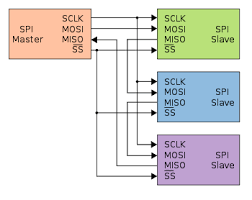

# Communication Protocols
## Types of data flow
1. Simple - One sender and one receiver and this flow is unidirectional.  
2. Half-Duplex - Data can flow in both the directions i.e sender can also act as receiver and vice-versa. But this does not occur simultaneoulsy. 
3. Full-Duplex - Data can flow in both direction simultaneoulsy. 

## Types of Communication Protocols -  
1. Synchronous - No clock is present and start and stop bits are used to indicate the data transfer.  
2. Asynchronous - The sender and receiver are connected by a clock wire and hence no start or stop bit is needed.  

## UART
1. UART-Universal Asynchronous Recieves Transmittor  
UART is an asynchronous type of communication protocol.  

**Process for the transfer of data through UART -** 
- The sender sends a start bit indicating the begining of the data transfer process.  
- The data from data bus is transmitted _parallelly_ to the UART Transmittor whereas from transmittor to the receiver it is sent _serially_.  
- Transmitting UART adds starting, parity and stop bit.  
- The receiver then converts the data into its original form and transfers to the data bus.  

**Configuration for transmission using UART -**  
- Regulatory bits i.e start and stop bits.  
- Baud rate  
- Parity bit  
 
---
## I2C
1.I2C is Inter-Integrated Circuit . It is a synchronous communication protocol.
2. It has two wires i.e  
**SDA - Serial Data** . It is a single wire for data transfer. Data is transfered from master to the slave and vice-versa via this wire. 
**SCL - Serial Clock** . This is a clock wire controlled by the master for synchronous communication.

**Process for the trasnfer of data through I2C -**
- The master 1st sends the _start_ bit. 
- Then a 7 to 10 bit slave address is sent.
- The master also sends a _read_ or _write_ bit to indicate direction of data transfer.
- The slave whose address bit matches then sends an acknowledgement bit to the master.
- After receiving the acknowledgement bit the master sends data in packs and the slave sends acknowledgement bits after every packet.
- Then the master sends the _stop_ bit to indicate completion of data transfer. 

**Start and Stop Bit**
- Start bit is when SDA shifts from _high_ to _low_ **before** SCL shifts from _high_ to _low_.  
- Stop bit is when SDA shifts from _low_ to _high_ **after** SCL does so.  
 
---
## SPI
1. SPI is Serial Peripheral Interface. It is a synchronous type of communication protocol.
2. Dta is transferred **serially**.
3. It has 4 pins i.e  
**SCK** : Serial Clock: Clock wire for synchronous communication. The master controls the clock using a frequency that the slave supports. 
**MOSI** : Master Output Slave Input pin. This pin is for sending data from master to the slave. **Most significant data first**  
**MISO** : Master Input Slave Output pin. This is used when slave sends data to the master. **Least significant data first**  
**CS** : Chip/Slave select pin. This is used to select the slave. The master sets the CS line of the slave it wants to connect to, to **low**.

**Process of data transfer by SPI**
- The master initiates the communication by setting the **clock signal**.
- The master then sets the **CS wire** of the slave it wants to connect to, to _low_ value.
- The data is transferred from the master to the slave through the **MOSI line**.
- If slave needs to respond to the master, it uses the **MISO line**.  
 
