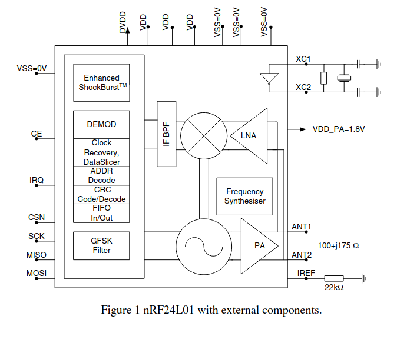

# NRF24L01
## Technical Specifications
- True **single chip** GFSK transceiver
- Package Handling Method - **Enhanced ShockBurst**
- Complete OSI Link Layer in hardware 
- Digital interface - SPI (speed 0-8 Mbps)
- 125 RF channel operation
- 5V tolerant signal input pads
- Power supply range: **1.9 to 3.6V**
- Current Consumption: **9.0 mA for output power:6dBm** and **12.3mA in RX mode** and **11.3mA in TX mode** 

## Constituents
1. Fully integrated frequency synthesizer
2. Power amplifier
3. Crystal oscillator, a demodulator, modulator and 
4. Demodulator
5. Modulator
6. Enhanced ShockBurst protocol engine. 

## Block Diagram
 
