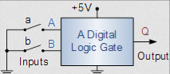
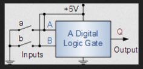
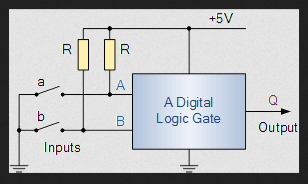

# Pull-up and Pull-down Resistors
## Pull-up Resistor
In a digital circuit the input value can take 2 values either a `0` or a `1`. But in case when the actual voltage value cannot be identified as a 0 or a 1 the input value is self-biased or it floats. This may result in _oscillations_ or uncertain values in the output making the circuit unusable.  
Understanding this with an example  
Consider a digital ciruit with 2 inputs **A** and **B** having connections as shown in the given image.  
  
Considering connection a - When a is **open** i.e circuit is **off** the actual value of input must the higher voltage let's say 5V but here the input value may float. To avoid this we need to connect A with a constant high voltage of 5V or VCC. This is illustrated in the image followed.  
  
The problem would be solved in this case and we would get a constant input of 1 when a is **open** i.e circuit is **off**, but in the other case, when a is **closed** i.e circuit is **on** the connection would be grounded and the high voltage would be directly connected to the 0V leading to short circuit. To tackle this issue we insert a Pull-up resistor i.e a _high value resistor_ to minimize the voltage drop and hence the current passing through it.  
  
_This gives us accurate input values and thus desired circuit with proper output values can be created._  

---

## Pull-down Resistor

Their working is similar to that of Pull-up resistor except the fact that we use _low value resistors_ in this case to give a constant input of 0V i.e the connection is grounded.
