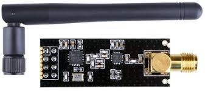
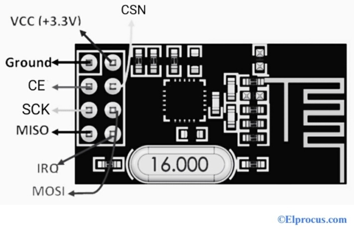
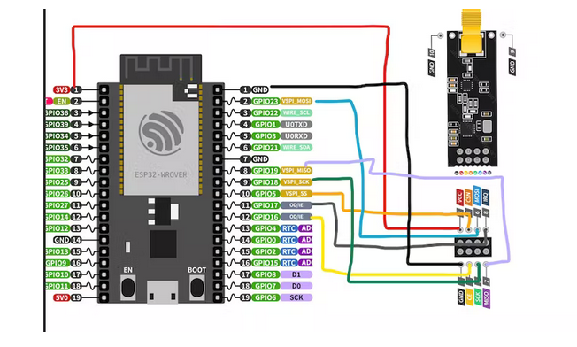

# esp-32_Radio-Transceiver
Make a long range Transceiver using ESP32 boards and send control commands as well as messages over a long range of about 1km.

## Table of Content
- [esp-32_Radio-Transceiver](https://github.com/SubodhBawankar/esp32-radio-tranciever/blob/Mentee-Janhavi/Notes/Readme.md#esp-32_radio-transceiver)
- [Table of Content](https://github.com/SubodhBawankar/esp32-radio-tranciever/blob/Mentee-Janhavi/Notes/Readme.md#table-of-content)
- [Project Details](https://github.com/SubodhBawankar/esp32-radio-tranciever/blob/Mentee-Janhavi/Notes/Readme.md#project-details)
- [SPI Communication Protocol](https://github.com/SubodhBawankar/esp32-radio-tranciever/blob/Mentee-Janhavi/Notes/Readme.md#spi-communication-protocol)
- [nRF24L01](https://github.com/SubodhBawankar/esp32-radio-tranciever/blob/Mentee-Janhavi/Notes/Readme.md#nrf24l01)
  - [Pin Configuration](https://github.com/SubodhBawankar/esp32-radio-tranciever/blob/Mentee-Janhavi/Notes/Readme.md#pin-configuration)
  - [Circuit Diagram](https://github.com/SubodhBawankar/esp32-radio-tranciever/blob/Mentee-Janhavi/Notes/Readme.md#circuit-diagram)
  - [Technical Specifications](https://github.com/SubodhBawankar/esp32-radio-tranciever/blob/Mentee-Janhavi/Notes/Readme.md#technical-specifications)
- [Getting started](https://github.com/SubodhBawankar/esp32-radio-tranciever/blob/Mentee-Janhavi/Notes/Readme.md#getting-started)
  - [Required installations](https://github.com/SubodhBawankar/esp32-radio-tranciever/blob/Mentee-Janhavi/Notes/Readme.md#required-installations)
 - [Project Installations](https://github.com/SubodhBawankar/esp32-radio-tranciever/blob/Mentee-Janhavi/Notes/Readme.md#project-installations)
- [Resources](https://github.com/SubodhBawankar/esp32-radio-tranciever/blob/Mentee-Janhavi/Notes/Readme.md#resources)
- [Acknowledgement](https://github.com/SubodhBawankar/esp32-radio-tranciever/blob/Mentee-Janhavi/Notes/Readme.md#acknowledgement)
- [Contributors](https://github.com/SubodhBawankar/esp32-radio-tranciever/blob/Mentee-Janhavi/Notes/Readme.md#contributors)
- [License](https://github.com/SubodhBawankar/esp32-radio-tranciever/blob/Mentee-Janhavi/Notes/Readme.md#license)

## Project Details
**Technologies and languages used**
- Free RTOS
- ESP-idf
- C
- CMake

## SPI Communication Protocol
1. SPI is Serial Peripheral Interface. It is a synchronous type of communication protocol.
2. Dta is transferred **serially**.
3. It has 4 pins i.e  
**SCK** : Serial Clock: Clock wire for synchronous communication. The master controls the clock using a frequency that the slave supports. 
**MOSI** : Master Output Slave Input pin. This pin is for sending data from master to the slave. **Most significant data first**  
**MISO** : Master Input Slave Output pin. This is used when slave sends data to the master. **Least significant data first**  
**CS** : Chip/Slave select pin. This is used to select the slave. The master sets the CS line of the slave it wants to connect to, to **low**.

**Process of data transfer by SPI**
- The master initiates the communication by setting the **clock signal**.
- The master then sets the **CS wire** of the slave it wants to connect to, to _low_ value.
- The data is transferred from the master to the slave through the **MOSI line**.
- If slave needs to respond to the master, it uses the **MISO line**.  
 

## nRF24L01
 
nRF24L01 is a RF module transceiver used to send and receive data using SPI communication. Each module can send and receive data. Each module has a unique address and can communicate with 6 other modules. 
It has - 
- frequency generator
- beat controller
- power amplifier
- crystal oscillator modulator and demodulator 

It operates in 3 modes-

- Transmittor
- Receiver
- Transceiver

### Pin Configuration
nRF24L01 has 8 pins for wireless transceiver module to establish communication with board and microcontroller(esp32 in our case). 
The following diagram indicates all 8 pins -  
 

### Circuit Diagram
The connections to be done with esp32 microcontroller to establish communication -  
 

### Technical Specifications
- RF module with 2.4GHz frequency
- Nominal current : 50mA.
- Maximum operating current : 250mA
- Covers a distance of 50-200 feet
- Communication Protocol : SPI
- Baud Rate : 250kbps to 2Mbps.
- Channel Range : 125.
- Maximum Nodes : 6
- Single chip GFSK transceiver module with OSI link layer hardware
- Features like auto ACK, retransmits, address, and CRC computation
- On air data rate : 1Mbps Or 2Mbps.
- Speed of digital interface(SPI) : 0-8Mbps
- RF Channel Operation Range : 125
- Tolerance Signal Input : 5V
- Power Supply Range : 1.9V to 3.6V

_For further information refer [Datasheet](https://www.sparkfun.com/datasheets/Components/SMD/nRF24L01Pluss_Preliminary_Product_Specification_v1_0.pdf)_

## Getting Started 
### Required installations 
**ESP_IDF** 
[Link for installations](https://github.com/espressif/esp-idf.git)

### Project Installations 
- Cloning the repo - In the terminal run -  
  `git clone https://github.com/SubodhBawankar/esp32-radio-tranciever.git `  
  `cd esp32-radio-tranciever` 
- Building the code  
`idf.py build` Make sure you activate esp-idf by `get_idf` 
- Flashing the code  
`idf.py -p (PORT) flash monitor` 

## Resources
[ESP-IDF API Reference](https://docs.espressif.com/projects/esp-idf/en/v4.2.4/esp32/api-reference/index.html) 
[nRF24L01 Datasheet](https://www.sparkfun.com/datasheets/Components/SMD/nRF24L01Pluss_Preliminary_Product_Specification_v1_0.pdf) 
[Reference](https://github.com/nopnop2002/esp-idf-mirf.git)

## Acknowledgement
[SRA VJTI](https://github.com/SRA-VJTI) 
Special acknowledgements to [Moteen Shah](https://github.com/Jamm02) , [Chinmay Lonkar](https://github.com/ChinmayLonkar) 

## Contributors
[Aryan Bawankar](https://github.com/SubodhBawankar) 
[Janhavi Deshpande](https://github.com/janhavi1803)

## License
[License for the project](https://github.com/SubodhBawankar/esp32-radio-tranciever/blob/main/LICENSE)
