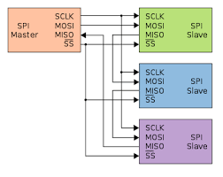
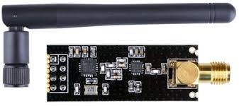
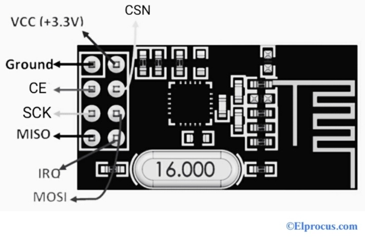
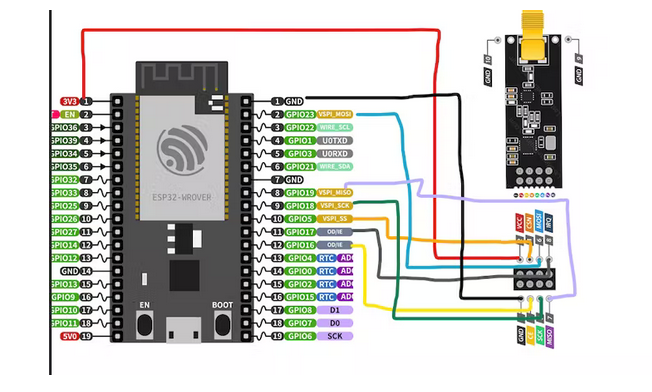

# esp32-radio-transceiver

A long-range Transceiver using ESP32 boards and send control commands as well as messages over a distance of about 1km. 📡✨

## Table of Contents

| Section                             | Description                                               |
|-------------------------------------|-----------------------------------------------------------|
| [Project Overview](#project-details) | Overview of the project and technologies used.           |
| [SPI Communication Protocol](#spi-communication-protocol) | Details about the SPI communication protocol.            |
| [nRF24L01](#nrf24l01)               | Information about the nRF24L01 RF module.                |
| [Pin Configuration](#pin-configuration) | Configuration details for nRF24L01 pins.                |
| [Circuit Diagram](#circuit-diagram) | Diagram showing the circuit connections.                  |
| [Technical Specifications](#technical-specifications) | Specifications of the nRF24L01 module.                  |
| [Getting Started](#getting-started) | Instructions to set up the project.                       |
| [Required Installations](#required-installations) | Necessary installations for the project.                 |
| [Resources](#resources)             | Useful links and references.                              |
| [Acknowledgement](#acknowledgement) | Acknowledgements to contributors and supporters.          |
| [Contributors](#contributors)       | List of contributors to the project.                      |
| [License](#license)                 | Licensing information for the project.                    |

## Project Details

**Technologies and languages used**:

- Free RTOS
- ESP-IDF
- C
- CMake

## SPI Communication Protocol

1. **SPI (Serial Peripheral Interface)** is a synchronous type of communication protocol. 🔄
2. Data is transferred **serially**. 📊
3. It has 4 pins:

   - **SCK**: Serial Clock
   - **MOSI**: Master Output Slave Input
   - **MISO**: Master Input Slave Output
   - **CS**: Chip/Slave Select

### Process of Data Transfer by SPI

- The master initiates communication by setting the **clock signal**. ⏰
- The master sets the **CS wire** of the slave to low. 🔌
- Data is transferred from the master to the slave through the **MOSI line**. 📤
- If the slave needs to respond, it uses the **MISO line**. 📥

  

## nRF24L01

  

The nRF24L01 is an RF module transceiver used to send and receive data using SPI communication. Each module can communicate with up to 6 other modules and operates in three modes:

- **Transmitter** 🚀
- **Receiver** 📥
- **Transceiver** 🔄

### Pin Configuration

nRF24L01 has 8 pins for establishing communication with the ESP32 microcontroller.

  

### Circuit Diagram

The following diagram illustrates the connections required to establish communication with the ESP32 microcontroller:

  

### Technical Specifications

- **Frequency**: 2.4GHz 🌐
- **Nominal Current**: 50mA
- **Max Operating Current**: 250mA
- **Covers a distance of**: 50-200 feet 📏
- **Communication Protocol**: SPI
- **Baud Rate**: 250kbps to 2Mbps
- **Channel Range**: 125
- **Max Nodes**: 6
- **Power Supply Range**: 1.9V to 3.6V ⚡

_For further information, refer to the [Datasheet](https://www.sparkfun.com/datasheets/Components/SMD/nRF24L01Pluss_Preliminary_Product_Specification_v1_0.pdf)_

## Getting Started

### Required Installations

**ESP-IDF** 🛠️

Follow the instructions in the [ESP-IDF Installation Guide](https://github.com/espressif/esp-idf.git).

### File Structure

<pre>
esp32-radio-tranciever/
├── 1_CommandTransciever
│   ├── CMakeLists.txt
│   ├── main
│   │   ├── CMakeLists.txt
│   │   └── main.c
│   └── sdkconfig
├── 2_MessageTransciever
│   ├── CMakeLists.txt
│   ├── main
│   │   ├── CMakeLists.txt
│   │   └── main.c
│   └── sdkconfig
├── assets
│   └── Images
│       ├── circuit.png
│       ├── I2C.png
│       ├── NRF24L01_BD.png
│       ├── NRF24L01.png
│       ├── nrf_circuit.png
│       ├── nrf_pin.png
│       ├── RTOS1.png
│       ├── RTOS2.png
│       ├── SPI.png
│       ├── UART.png
│       ├── without_resistors.png
│       └── with_resistors.png
├── components
│   ├── CMakeLists.txt
│   ├── include
│   │   ├── i2cdev.h
│   │   ├── motor.h
│   │   ├── oled.h
│   │   ├── spi2.h
│   │   ├── spi.h
│   │   ├── switch.h
│   │   └── u8g2_esp32_hal.h
│   ├── src
│   │   ├── i2cdev.c
│   │   ├── motor.c
│   │   ├── oled.c
│   │   ├── spi2.c
│   │   ├── spi.c
│   │   ├── switch.c
│   │   └── u8g2_esp32_hal.c
│   └── u8g2
├── documentation
│   ├── 1_led_blink.md
│   ├── 2_kicad.md
│   ├── 3_Communication Protocols.md
│   ├── 4_Adc notes.md
│   ├── 5_OLED.md
│   ├── 6_repo_file_structure.md
│   └── images
│       ├── Spi 1.png
│       ├── Spi 2.png
│       └── Spi 3.png
├── LICENSE
├── README.md
└── Report
    └── Report.pdf
</pre>

### Project Installations 
- Cloning the repo - In the terminal run -  
  `git clone https://github.com/SubodhBawankar/esp32-radio-tranciever.git `  
  `cd esp32-radio-tranciever` 
- Building the code  
`idf.py build` Make sure you activate esp-idf by `get_idf` 
- Flashing the code  
`idf.py -p (PORT) flash monitor` 

## Resources

- [ESP-IDF API Reference](https://docs.espressif.com/projects/esp-idf/en/v4.2.4/esp32/api-reference/index.html)
- [nRF24L01 Datasheet](https://www.sparkfun.com/datasheets/Components/SMD/nRF24L01Pluss_Preliminary_Product_Specification_v1_0.pdf)
- [SPI Communication Protocol](https://docs.espressif.com/projects/esp-idf/en/latest/esp32/api-reference/peripherals/spi_master.html)

## Acknowledgement

Special thanks to [SRA VJTI](https://github.com/SRA-VJTI) for their support! 🙏

Special acknowledgements to [Moteen Shah](https://github.com/Jamm02) and [Chinmay Lonkar](https://github.com/ChinmayLonkar) for their invaluable contributions! 🌟

## Contributors

- [Aryan Bawankar](https://github.com/SubodhBawankar)
- [Janhavi Deshpande](https://github.com/janhavi1803)

## License

For licensing information, please refer to the [License for the project](https://github.com/SubodhBawankar/esp32-radio-tranciever/blob/main/LICENSE).

---

  

Feel free to explore the project and contribute! 🚀 If you have any questions, don't hesitate to reach out! 🤔
